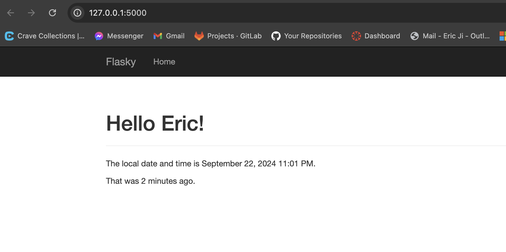
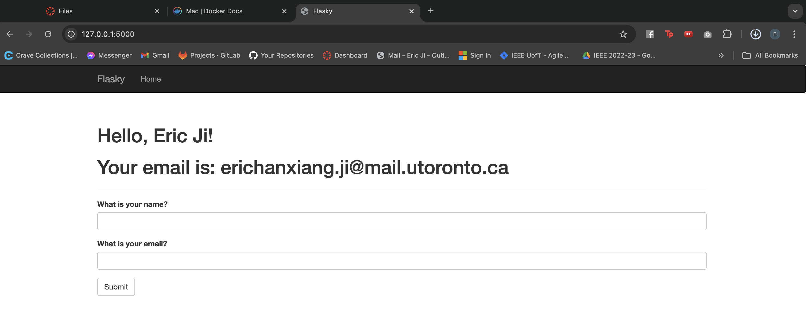
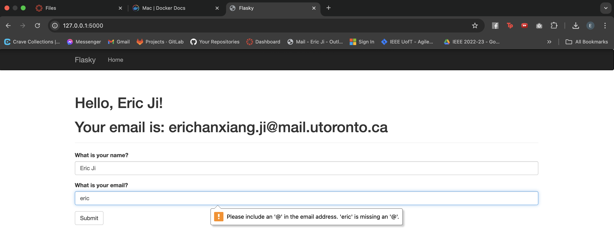
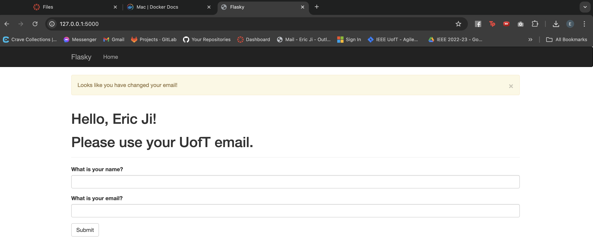

# E444-F2024-PRA2
This repo is a clone of https://github.com/miguelgrinberg/flasky

## Activity 1.3


## Activity 1.4
### Valid Name and Email


### Valid Name and Invalid Email


### Valid Name and Wrong Email Domain


## Docker Commands
```docker build -t flask-app .```    
```docker run -p 5001:5000 flask-app```